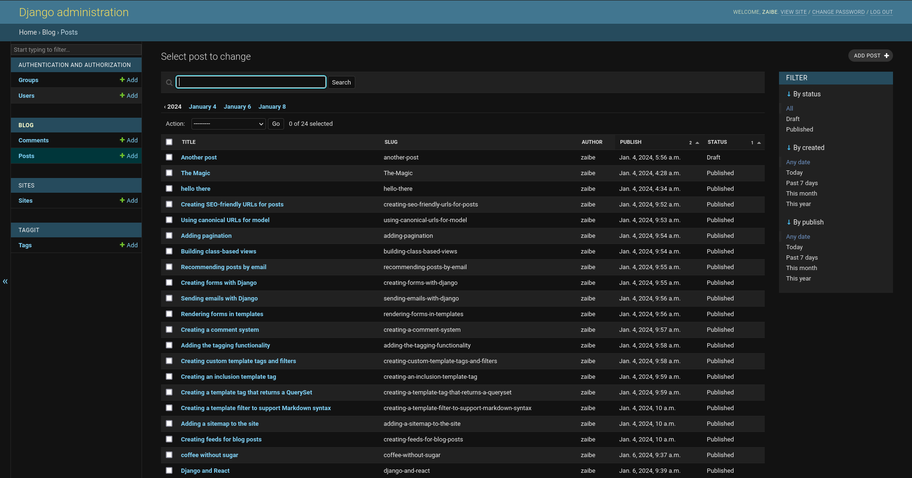

Key Highlights:

✨ Diverse Content: Immerse yourself in a world of diverse content, spanning from informative articles to captivating narratives, meticulously curated to cater to your intellectual curiosity.

🚀 Seamless Navigation: Navigate through a clutter-free and intuitive website for a hassle-free reading experience. Find what matters to you, effortlessly.

🖋️ Contributor Network: Join our community of passionate writers and thinkers. Contribute your insights, share your stories, and be part of a platform that values your voice.

🔍 Smart Search: Dive into a vast ocean of knowledge with our smart search feature. Find relevant articles swiftly, ensuring you spend more time reading and less time searching.

🌐 Responsive Design: Enjoy Insight Blogs on any device. Our responsive design ensures a consistent and enjoyable reading experience, whether you're on your laptop, tablet, or smartphone.

📈 Stay Informed: Stay updated with the latest trends and ideas. Insight Blogs keeps you informed, inspired, and ahead of the curve.

🔒 Secure and Private: Your privacy is our priority. Enjoy a secure and private reading environment, free from unnecessary interruptions.

💬 Engage with Insight: Share your thoughts, engage in discussions, and connect with like-minded individuals. Insight Blogs is not just a platform; it's a community.

📱 Join Us Today: Embark on a journey of knowledge and discovery. Experience the power of words with Insight Blogs. Your ideas matter.

👉 Explore Now - Insight Blogs, Where Knowledge Meets Expression! 🌟

**Book Reference:** [Django 4 by Example](https://www.packtpub.com/product/django-4-by-example-fourth-edition/9781801813051)

The book offers professionals level projects with detailed explanations, making it an invaluable resource for building robust Django applications.

## Admin Page

- This image showcases the admin page for the Django website where administrative tasks can be managed.

## Page 2

- In this image, you can see the second page of the website, featuring additional blog post details.

## Pagination

- The pagination functionality allows users to navigate between different pages of blog posts easily.

## RSS Feed Interface

- This image reveals the interface for the RSS feed, presenting all the data in a feed format.

## Base HTML Code

- The code snippet represents the base HTML template used across the website, providing a consistent layout.

## Comments Section

- In this image, you can see the comments section where users can engage and leave comments on blog posts.

## Website Interface

- Here is a snapshot of the main interface of the website, providing an overview of the blog content.

## Detail Page

- Clicking on a blog post leads to this detail page, offering a preview of the full content.

## Forms Code

- This image displays the code for forms used in the website, allowing users to input and submit data.

## Models Code

- The image showcases the Django model code, defining the structure and properties of the database.

## Tags Code

- The code snippet illustrates the implementation of tags, allowing categorization of blog posts.

## URLs Code

- This image showcases the code responsible for handling and routing URLs in the Django website.

## View Code

- Here, you can see the code for the view file, defining how data is presented and processed on the website.
